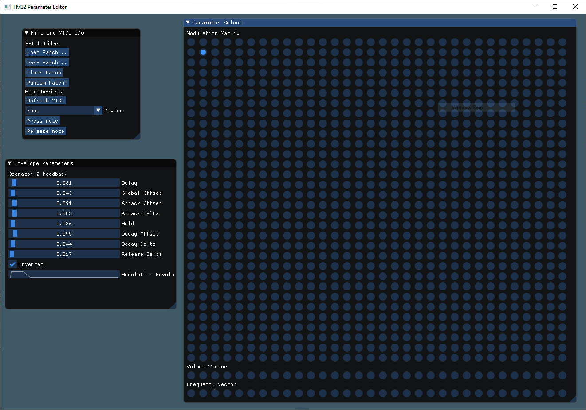

  

**FM32** is an experiment in GPU-powered sound synthesis - as the name and logo allude to, it's inspired by _Native Instruments'_ FM8 synthesizer, which itself is an extension of the architecture present in old physical synthesizers such as the Yamaha DX7. Its main distinction from FM8, however, is having 32 fully connected operators and (by default) 32-voice polyphony, to the cost of a much simplified (but pure in the functional sense) envelope generator for every parameter - and going beyond the DX7 and FM8, since each feedback route/slot also has its own envelope, allowing for very interesting, time-varying evolving sounds.

It is developed in **CUDA** and **C++14**, using **SDL2** for display, mouse input, and audio output; **Dear ImGui** for GUI; and **RTMidi** for MIDI interfacing. As of early 2020, performance is such that it's able to run up to 12 notes of polyphony at 48kHz under a GeForce 640M, and the full 32 notes under a Quadro P400; both weak GPUs by today's standards.

Due to its heavily templatized architecture, all of these parameters are adjustable in code, however; nothing stops you from making _FM5000_ from this code, save for the limitations on current GPU computing power, and the practical hassle of making a good patch with 25 million parameters to tune by hand.

## Sound samples

To-do!

## GUI

  

## License

Like my other project, [VQLib](https://github.com/MVittiS/VQLib), FM32 is distributed under a custom license that allows you to do anything with this code, as long as you don't make money out of the code itself - feel free to use the generated sounds in anything commercial and free alike, or even sell patches/presets. Just don't forget to give me a shout-out!